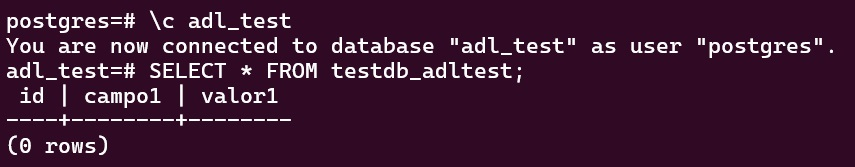
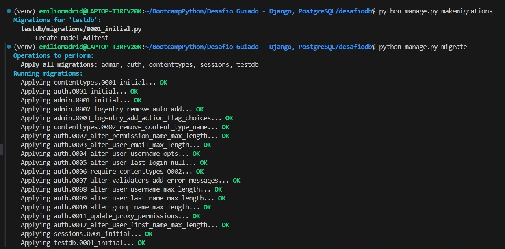
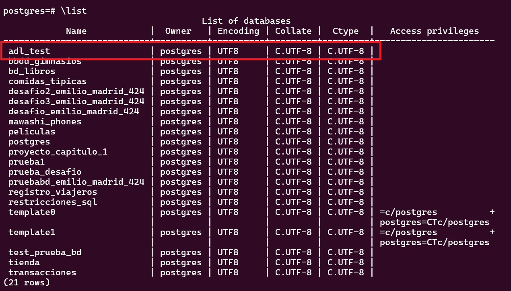
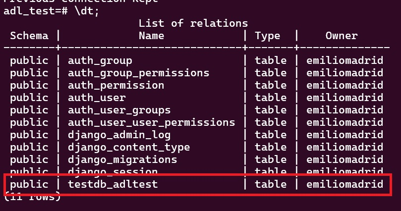
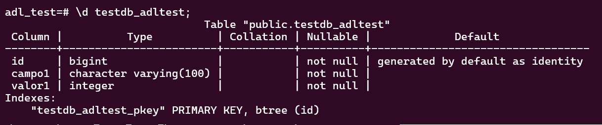

# Desafio Base de Datos - Django y Postgres

Captura Requerimiento 1

Captura Requerimiento 3

Captura Requerimiento 4

## Descripción

El proyecto se compone de dos partes principales:

Proyecto Django: Se crea un proyecto Django llamado "desafiodb".
Aplicación Django: Dentro del proyecto, se crea una aplicación llamada "testdb".

## Objetivos

El objetivo es conectar el proyecto con una base de datos PostgreSQL local llamada "adl-test". Luego, se generarán y aplicarán migraciones para crear una tabla llamada "adltest" con los siguientes campos:

- campo1: Un campo de tipo char con longitud de 100.
- valor1: Un campo de tipo entero.

## Empezando 🚀

Para realizar este desafio, necesitas tener Python 3 instalado en tu sistema. Se recomienda usar un navegador web moderno como Google Chrome para acceder a la documentación en inglés y permitir la traducción automática del contenido.

### Pre-requisitos 📋

- Python 3.
- Conocimientos básicos de programación en Python.
- Conocimientos básicos de uso de la terminal o consola de comandos.
- Acceso a Internet para consultar la documentación oficial de Django y tutoriales complementarios.

## Autores ✒️

- **Emilio Madrid** - [EmilioMadridA](https://github.com/EmilioMadridA)

## Agradecimientos 🎁

- A todo el equipo de Desafio Latam y Talento Digital por la oportunidad de aprender y crecer en el campo del desarrollo web con Python y Django.
- A Brayan y Gustavo, por todo lo enseñado.